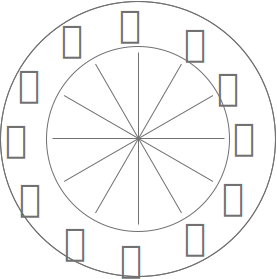
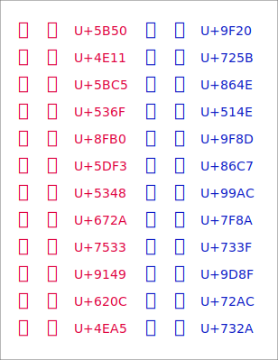

# YUDongbaZodiacAnimals font

## About
YUDongbaZodiacAnias font is a Dongba Zodiac 12 Animals font.

Dongba Zodiac is a East Asian Zodiac.

12 Animals are:
- mouse 🐭  
- ox 🐮  
- tiger 🐯  
- rabbit 🐰  
- dragon 🐲  
- snake 🐍  
- horse 🐴  
- goat 🐏  
- monkey 🐵  
- rooster 🐔  
- dog 🐶  
- pig 🐗  
.

Please use for New Year cards etc. 😃  

## Glyphs and Encoding
This font contained only simplified glyph of Zodiac 12 Animals.  
And glyphs coding maps are selected in Japanese Kanji style.  
There are two series, zodiac animals and normal animals.

## Contents
True Type font:
- YUDongbaZodiacAnimals-Regular.ttf

For Font Editors:
- YUDongbaZodiacAnimals-Regular.fog (Original Fontographer Edit file)
- YUDongbaZodiacAnimals-Regular.vfb (for FontLab user)
- YUDongbaZodiacAnimals-Regular.ufo (UFO format)

## License
MIT License  
&copy; 2020-2021 @miukumauku of HDL
